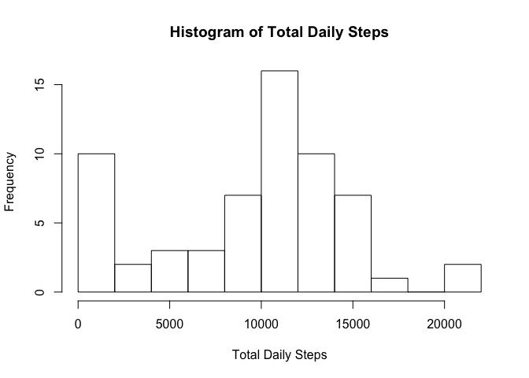
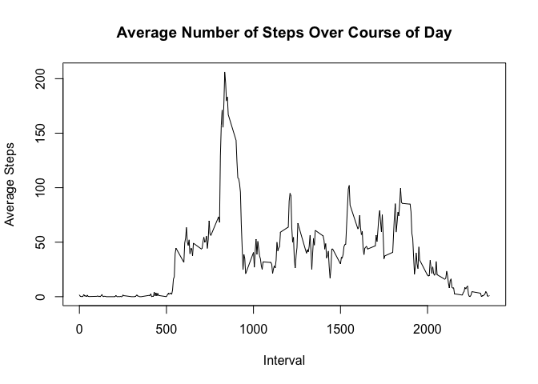
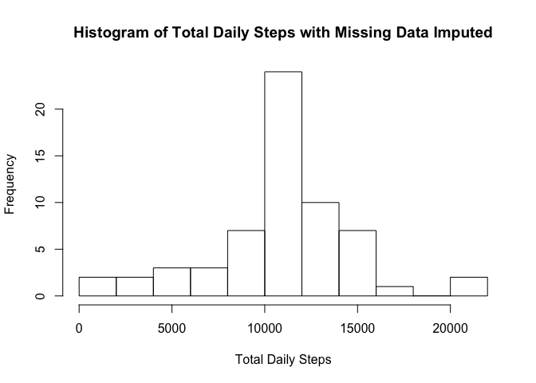
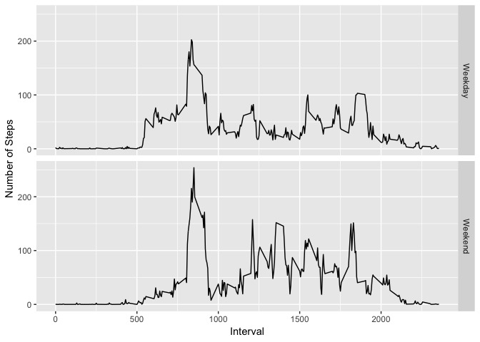

## Load Necessary Libraries

```r
library(lubridate)
library(dplyr)
library(ggplot2)
```


## Loading and preprocessing the data


```r
unzip("activity.zip", overwrite = TRUE)
activity <- read.csv("activity.csv")

# convert date to date
activity$date <- ymd(activity$date)
```


## What is mean total number of steps taken per day?

```r
daily_avg_steps <- activity %>% group_by(date) %>% summarize(total_steps = sum(steps, na.rm = TRUE))
mean_steps <- mean(daily_avg_steps$total_steps, na.rm = TRUE)
median_steps <- median(daily_avg_steps$total_steps, na.rm = TRUE)
hist(daily_avg_steps$total_steps, breaks=10, 
     xlab = "Total Daily Steps", 
     main = "Histogram of Total Daily Steps")
```

<!-- -->

The average number of steps taken per day is 9354 and the median number of steps taken per day is 10395.

## What is the average daily activity pattern?

```r
interval_avg_steps <- activity %>% group_by(interval) %>% summarize(avg_steps = mean(steps, na.rm = TRUE))
max_interval <- with(interval_avg_steps,interval[which.max(avg_steps)])
max_hour <- floor(max_interval / 60)
max_minute <- max_interval %% 60
if (max_hour > 12) {
    ampm <- "PM"
    max_hour <- max_hour - 12
} else if (max_hour == 12) {
    ampm <- "PM"
}  else {
    ampm <- "AM"
}
max_time <- paste0(max_hour,":",sprintf("%02d", max_minute)," ",ampm)
with(interval_avg_steps,plot(interval,avg_steps,
                             type="l",
                             xlab="Interval",ylab="Average Steps",
                             main="Average Number of Steps Over Course of Day"))
```

<!-- -->

The interval 835 contains the maximum average number of steps across all days. This interval starts at 1:55 PM.

## Imputing missing values

```r
missing_rows <- sum(is.na(activity$steps))
total_rows <- nrow(activity)

activity_imp <- left_join(activity, interval_avg_steps, by="interval")
activity_imp$steps[is.na(activity_imp$steps)] = activity_imp$avg_steps[is.na(activity_imp$steps)]
activity_imp <- select(activity_imp,steps,date,interval)

daily_avg_steps_imp <- activity_imp %>% group_by(date) %>% summarize(total_steps = sum(steps, na.rm = TRUE))
mean_steps_imp <- mean(daily_avg_steps_imp$total_steps, na.rm = TRUE)
median_steps_imp <- median(daily_avg_steps_imp$total_steps, na.rm = TRUE)
print(mean_steps_imp)
```

```
## [1] 10766.19
```

```r
mean_direction <- ifelse(mean_steps_imp >= mean_steps, "up", "down")
median_direction <- ifelse(median_steps_imp >= median_steps, "up", "down")
hist(daily_avg_steps_imp$total_steps, breaks=10, 
     xlab = "Total Daily Steps", 
     main = "Histogram of Total Daily Steps with Missing Data Imputed")
```

<!-- -->

2304 out of 17568 rows are missing data. We can replace the missing values with the average value for that interval. We have done this in order to create the histogram above. After imputing the values for the missing data, the average number of daily steps is 10766 and the median number of daily steps is 10766. The average number of steps has gone up and the median number of steps has gone up.


## Are there differences in activity patterns between weekdays and weekends?

```r
activity_imp$isWeekend <- ifelse(wday(activity_imp$date) > 5, "Weekend", "Weekday")
avg_steps <- activity_imp %>% group_by(interval,isWeekend) %>% summarize(steps = mean(steps, na.rm = TRUE))
ggplot(avg_steps, aes(x=interval,y=steps)) + 
    geom_line() + 
    facet_grid(rows = vars(isWeekend)) +
    labs(x = "Interval", y = "Number of Steps")
```

<!-- -->
